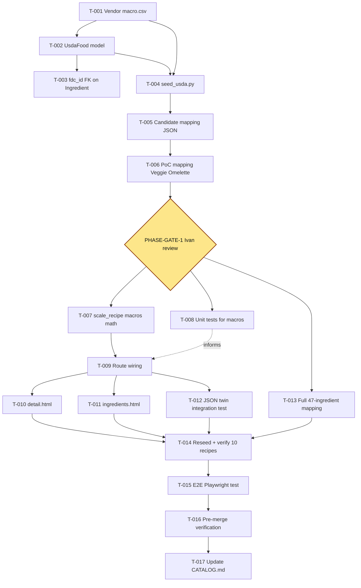

# PRP-USDA-MACROS-001 — USDA Macronutrient Totals on Recipes

**Status:** APPROVED
**Approved:** 2026-04-23 by Ivan (Director ARCH)
**Confirmations:**
- Raw-vs-cooked default = raw unless ingredient name says otherwise
- Coexist v1: hardcoded `recipe.carbs_g` NOT overwritten
**Authored:** 2026-04-23
**Owner:** Ivan (Director ARCH)
**Feature slug:** `usda-macros`
**Phase:** App Phase 1 additive (public, read-only, no feature flag)
**Related docs:** `docs/CATALOG.md` (Features table — new row to be added in T-USDA-MACROS-017), `docs/PHASE-4-EXECUTION-PLAN.md` Slice A (scaling pattern).

---

## 1. Summary

Add USDA-derived macronutrient totals — **kcal, protein_g, carbs_g, fat_g** — to every recipe. For each recipe:

1. Each `Ingredient` row is mapped (once, manually) to one USDA `fdc_id`.
2. At render time, the scaling service multiplies per-100g USDA values by each ingredient's scaled grams / 100 and sums across ingredients to produce a recipe total.
3. The recipe detail page, ingredients page, and their JSON twins display **per-serving** values (recipe total / `target_servings`) and expose the recipe total alongside.

The existing hardcoded `recipe.carbs_g`, `sodium_mg`, `potassium_mg`, `phosphorus_mg` columns (consumed by the compliance engine) are **untouched**. The new USDA-derived carbs coexist as a clearly-labeled "USDA estimate" block.

**Data source:** `https://faculty-web.msoe.edu/yoder/macro.csv` — 14,585 rows, schema `fdc_id,description,calories,proteinInGrams,carbohydratesInGrams,fatInGrams`, all values per 100g. Vendored into `fixtures/macro.csv` so runtime never hits the prof's server.

**Scope constraints:**
- No auth changes. All touched routes are already public.
- No feature flag. Additive and reversible by revert.
- PoC-gated rollout: one recipe (Veggie Omelette, `recipe_id=2`) mapped and hand-verified first; remaining 44 ingredients mapped only after PHASE-GATE-1 passes.
- Raw-vs-cooked policy: map to **raw** USDA entries by default; only use cooked entries when the recipe ingredient name contains "cooked" / "roasted" / "grilled" / etc. Documented in the mapping JSON.

## 2. Ground Truth (do not re-explore)

- **Ingredient model** (`app/models/recipe.py:51-62`) has columns `id, name, allergen_tags, unit_cost_cents`. No nutrition fields today.
- **RecipeIngredient** (`app/models/recipe.py:65-76`) stores integer `grams` at `base_yield`.
- **Recipe** (`app/models/recipe.py:25-48`) has hardcoded `carbs_g, sodium_mg, potassium_mg, phosphorus_mg` — compliance engine reads these; **do not overwrite**.
- **Fixtures:** 10 recipes, 47 distinct ingredient names in `fixtures/recipes.json`. All quantities in grams.
- **Scaling flow:** `app/routes/recipes.py::_get_recipe_with_ingredients` (lines 44-93) → `app/services/scaling.py::scale_recipe` (lines 47-78). Pure function, TypedDict return.
- **Display:** existing "Nutrition (per serving)" block at `app/templates/recipes/detail.html:13-21`. `ingredients.html` has a total-grams tfoot at lines 37-43 — extend with a macros tfoot row.
- **Public routes (no auth):** `/recipes`, `/recipes/{id}`, `/recipes/{id}/ingredients`, plus JSON twins at `/api/v1/recipes/*`.
- **Tests:** `tests/unit/test_scaling.py` has 5 existing tests using Overnight Oats sample.
- **Seed script:** `scripts/seed_db.py` is idempotent on natural keys.
- **DB init pattern:** `app/db/init_schema.py` uses `SQLModel.metadata.create_all` — new `UsdaFood` model gets imported there.

## 3. Agreed Design

| # | Decision | Rationale |
|---|---|---|
| D1 | New table `usda_food` — SQLModel, cols: `fdc_id (PK int), description, kcal_per_100g (float), protein_g_per_100g (float), carbs_g_per_100g (float), fat_g_per_100g (float)` | Separate table = clean seed/reseed; no pollution of Ingredient schema. |
| D2 | Vendor `macro.csv` into `fixtures/macro.csv` | No network dep at seed time. ~1.2MB file — small. |
| D3 | Add nullable `fdc_id` FK on `Ingredient` → `usda_food.fdc_id` | One ingredient maps to one USDA row. Nullable so we can ship without full coverage. |
| D4 | `fixtures/ingredient_fdc_mapping.json` — `[{ingredient_name, fdc_id, note}]` pairs for all 47 ingredients | Human-reviewable artifact; seed script backfills `Ingredient.fdc_id` from it. |
| D5 | Extend `scale_recipe()` signature with optional `macros_lookup`; return `total_kcal, total_protein_g, total_carbs_g, total_fat_g` on `ScaledRecipe`. Keep pure. | Pure-function property preserved; backward compatible. |
| D6 | Route handler loads macros lookup once per request via `SELECT ... WHERE fdc_id IN (...)` | One extra query per request, ≤47 rows max. |
| D7 | Display: add "USDA macros (per serving)" section below existing "Nutrition (per serving)" on `detail.html`; add macros tfoot to ingredients table. Label clearly "USDA estimate". | Non-destructive to compliance-engine data; visually distinct. |
| D8 | JSON twin schema additions: `scaled.total_kcal, total_protein_g, total_carbs_g, total_fat_g, per_serving_*` | Additive fields — FE can adopt lazily. |
| D9 | PoC-first: Veggie Omelette (`recipe_id=2`) mapped + hand-checked before remaining ingredients | P13 Rollout Pattern; cheap rollback if math wrong. |
| D10 | Raw-vs-cooked: default raw; override to cooked only if recipe ingredient name explicitly says so | Deterministic, reviewable. |
| D11 | Unit tests: pin Veggie Omelette macros at `base_yield=1`, assert linear scaling at 2x. | Lock math with a gold-master test. |
| D12 | Missing-coverage policy: any ingredient with `fdc_id IS NULL` → all four totals return `None`, UI shows "macros unavailable" badge. | Prevents silently-wrong totals. |

## 4. ATOMIC-S Task Decomposition (summary)

Six phases, 17 tasks + 1 human gate. Full file-touch list + verification per task lives in the YAML task_graph at §8.

### Phase A — Foundation (sequential)

- **T-USDA-MACROS-001** Vendor macro.csv → `fixtures/macro.csv`
- **T-USDA-MACROS-002** Add `UsdaFood` SQLModel + register in `app/db/init_schema.py`
- **T-USDA-MACROS-003** Add nullable `fdc_id` FK to `Ingredient` (‖ T-004)
- **T-USDA-MACROS-004** `scripts/seed_usda.py` CSV loader (‖ T-003)

### Phase B — Mapping (blocking gate — HUMAN review)

- **T-USDA-MACROS-005** Draft candidate mapping JSON (fuzzy top-3 per ingredient)
- **T-USDA-MACROS-006** PoC: hand-finalize Veggie Omelette ingredients only
- **T-PHASE-GATE-1** Ivan reviews PoC mapping + hand-calcs match (BLOCKING)

### Phase C — Math + Tests (parallel after gate)

- **T-USDA-MACROS-007** Extend `scale_recipe()` with macros math (‖ T-008)
- **T-USDA-MACROS-008** Unit tests for macros math (‖ T-007)
- **T-USDA-MACROS-009** Wire route handlers to pass macros_lookup

### Phase D — Display + API (parallel)

- **T-USDA-MACROS-010** Update `detail.html` with USDA macros block (‖ T-011, T-012, T-013)
- **T-USDA-MACROS-011** Update `ingredients.html` with macros tfoot (‖ T-010, T-012, T-013)
- **T-USDA-MACROS-012** JSON twin integration test (‖ T-010, T-011, T-013)
- **T-USDA-MACROS-013** Finalize remaining 44 ingredient mappings (‖ T-010, T-011, T-012)

### Phase E — Full rollout

- **T-USDA-MACROS-014** Reseed + verify all 10 recipes render (‖ T-015)
- **T-USDA-MACROS-015** E2E Playwright test (‖ T-014)

### Phase F — Ship

- **T-USDA-MACROS-016** Pre-merge verification harness
- **T-USDA-MACROS-017** Update `docs/CATALOG.md` (+ optional `DEMO-SCRIPT.md`)

## 5. Dependency graph



## 6. Parallelization plan (worktree waves)

| Wave | Parallel tasks | File sets (disjoint) |
|---|---|---|
| W1 | T-001 | `fixtures/macro.csv`, `.gitignore` |
| W2 | T-002 | `app/models/usda_food.py`, `app/db/init_schema.py` |
| W3 | T-003 ‖ T-004 | T-003: `app/models/recipe.py` / T-004: `scripts/seed_usda.py`, `Makefile` |
| W4 | T-005 | `fixtures/ingredient_fdc_mapping_candidates.json`, `scripts/draft_usda_mapping.py` |
| W5 | T-006 | `fixtures/ingredient_fdc_mapping.json` |
| W6 | **PHASE-GATE-1** (human) | — |
| W7 | T-007 ‖ T-008 | T-007: `app/services/scaling.py` / T-008: `tests/unit/test_scaling.py` |
| W8 | T-009 | `app/routes/recipes.py` |
| W9 | T-010 ‖ T-011 ‖ T-012 ‖ T-013 | disjoint template / test / fixture files |
| W10 | T-014 ‖ T-015 | verification / E2E test |
| W11 | T-016 | — (runs the harness) |
| W12 | T-017 | `docs/CATALOG.md`, `docs/DEMO-SCRIPT.md` |

**Conflict hotspots:**
1. `fixtures/ingredient_fdc_mapping.json` — T-006 then T-013, strictly sequential.
2. `scripts/seed_db.py` — T-013 single-owner.
3. `app/routes/recipes.py` — T-009 single-owner.

## 7. Risk log

| Risk | Likelihood | Impact | Mitigation |
|---|---|---|---|
| Mapping accuracy — chosen USDA row doesn't match ingredient form | Medium | Medium | PHASE-GATE-1 manual review; tolerance-tested unit test; "USDA estimate" label. |
| Raw vs cooked mismatch | Medium | Medium | Raw-default policy (D10); override in mapping `note`. |
| Coverage gap (salt/pepper, etc.) | High | Low | D12 `None` totals + "unavailable" badge. |
| macro.csv upstream changes format | Low | Medium | Vendored (D2); no runtime dep. |
| Performance — extra SELECT per request | Low | Low | ≤47 PKs, PK index automatic. |
| SQLite schema migration on dev DBs | Medium | Low | `rm data/ds-meal.db && make seed-usda && make seed-db` documented. |
| Compliance engine regression | Low | High | D7 non-destructive; T-016 manual check. |

## 8. 6-Stage DoD Matrix

| Stage | Evidence | Completing Task |
|---|---|---|
| 1 Unit Tests | `tests/unit/test_scaling.py` +4 tests green | T-008 |
| 2 Integration | `tests/integration/test_recipes_api.py` +1 test green | T-012 |
| 3 E2E Playwright | `tests/e2e/test_usda_macros_e2e.py` green | T-015 |
| 4 Deployed | Live on `ds-meal.dulocore.com`, macros render on all 10 recipes | T-014 + redeploy |
| 5 Real Auth | N/A — feature is public | skipped by design |
| 6 User Accessible | CATALOG row SHIPPED; DEMO-SCRIPT mention | T-017 |

## 9. Task graph (YAML)

```yaml
prp: PRP-USDA-MACROS-001
status: APPROVED
feature_slug: usda-macros
tasks:
  - id: T-USDA-MACROS-001
    title: Vendor macro.csv into fixtures/
    owner_tier: Worker
    depends_on: []
    parallelizable_with: []
    files: [fixtures/macro.csv, .gitignore]
  - id: T-USDA-MACROS-002
    title: Add UsdaFood SQLModel + register in init_schema
    owner_tier: Worker
    depends_on: [T-USDA-MACROS-001]
    parallelizable_with: []
    files: [app/models/usda_food.py, app/db/init_schema.py]
  - id: T-USDA-MACROS-003
    title: Add nullable fdc_id FK to Ingredient
    owner_tier: Worker
    depends_on: [T-USDA-MACROS-002]
    parallelizable_with: [T-USDA-MACROS-004]
    files: [app/models/recipe.py]
  - id: T-USDA-MACROS-004
    title: scripts/seed_usda.py CSV loader
    owner_tier: Worker
    depends_on: [T-USDA-MACROS-002, T-USDA-MACROS-001]
    parallelizable_with: [T-USDA-MACROS-003]
    files: [scripts/seed_usda.py, Makefile]
  - id: T-USDA-MACROS-005
    title: Draft candidate mapping JSON (fuzzy top-3)
    owner_tier: Worker
    depends_on: [T-USDA-MACROS-004]
    parallelizable_with: []
    files: [fixtures/ingredient_fdc_mapping_candidates.json, scripts/draft_usda_mapping.py]
  - id: T-USDA-MACROS-006
    title: PoC mapping Veggie Omelette (7 ingredients)
    owner_tier: Worker
    depends_on: [T-USDA-MACROS-005]
    parallelizable_with: []
    files: [fixtures/ingredient_fdc_mapping.json]
  - id: T-PHASE-GATE-1
    title: Ivan reviews PoC mapping + hand-calcs match
    owner_tier: Manager
    type: human_gate
    depends_on: [T-USDA-MACROS-006]
    parallelizable_with: []
    files: []
  - id: T-USDA-MACROS-007
    title: Extend scale_recipe() with macros math
    owner_tier: Worker
    depends_on: [T-PHASE-GATE-1]
    parallelizable_with: [T-USDA-MACROS-008]
    files: [app/services/scaling.py]
  - id: T-USDA-MACROS-008
    title: Unit tests for macros math
    owner_tier: Worker
    depends_on: [T-PHASE-GATE-1]
    parallelizable_with: [T-USDA-MACROS-007]
    files: [tests/unit/test_scaling.py]
  - id: T-USDA-MACROS-009
    title: Wire route handlers to pass macros_lookup
    owner_tier: Worker
    depends_on: [T-USDA-MACROS-007]
    parallelizable_with: []
    files: [app/routes/recipes.py]
  - id: T-USDA-MACROS-010
    title: Update detail.html with USDA macros block
    owner_tier: Worker
    depends_on: [T-USDA-MACROS-009]
    parallelizable_with: [T-USDA-MACROS-011, T-USDA-MACROS-012, T-USDA-MACROS-013]
    files: [app/templates/recipes/detail.html]
  - id: T-USDA-MACROS-011
    title: Update ingredients.html with macros tfoot
    owner_tier: Worker
    depends_on: [T-USDA-MACROS-009]
    parallelizable_with: [T-USDA-MACROS-010, T-USDA-MACROS-012, T-USDA-MACROS-013]
    files: [app/templates/recipes/ingredients.html]
  - id: T-USDA-MACROS-012
    title: JSON twin integration test
    owner_tier: Worker
    depends_on: [T-USDA-MACROS-009]
    parallelizable_with: [T-USDA-MACROS-010, T-USDA-MACROS-011, T-USDA-MACROS-013]
    files: [tests/integration/test_recipes_api.py]
  - id: T-USDA-MACROS-013
    title: Finalize mapping for remaining 44 ingredients
    owner_tier: Worker
    depends_on: [T-PHASE-GATE-1]
    parallelizable_with: [T-USDA-MACROS-010, T-USDA-MACROS-011, T-USDA-MACROS-012]
    files: [fixtures/ingredient_fdc_mapping.json, scripts/seed_db.py]
  - id: T-USDA-MACROS-014
    title: Reseed + verify all 10 recipes render
    owner_tier: Worker
    depends_on: [T-USDA-MACROS-013, T-USDA-MACROS-010, T-USDA-MACROS-011, T-USDA-MACROS-012]
    parallelizable_with: [T-USDA-MACROS-015]
    files: [fixtures/ingredient_fdc_mapping.json]
  - id: T-USDA-MACROS-015
    title: E2E Playwright test
    owner_tier: Worker
    depends_on: [T-USDA-MACROS-014]
    parallelizable_with: [T-USDA-MACROS-014]
    files: [tests/e2e/test_usda_macros_e2e.py]
  - id: T-USDA-MACROS-016
    title: Pre-merge verification harness
    owner_tier: Manager
    depends_on: [T-USDA-MACROS-015]
    parallelizable_with: []
    files: []
  - id: T-USDA-MACROS-017
    title: Update docs/CATALOG.md (+ optional DEMO-SCRIPT.md)
    owner_tier: Worker
    depends_on: [T-USDA-MACROS-016]
    parallelizable_with: []
    files: [docs/CATALOG.md, docs/DEMO-SCRIPT.md]
```

---

**Status: APPROVED**

---

## Appendix A — Staging for T-017 Ship Task

> **Purpose.** Pre-authored copy for the `docs/CATALOG.md` row and the `docs/DEMO-SCRIPT.md` blurb that T-USDA-MACROS-017 will paste in verbatim. Drafted during the prep pass so T-017 becomes a mechanical copy-paste with no authorship judgement required. **Delete this appendix as the final housekeeping step of T-017** (see checklist below).
>
> **Do NOT apply any of this content to CATALOG.md or DEMO-SCRIPT.md yet.** That is T-017's job, and it must happen only after T-016 (pre-merge verification) and T-014 (all 10 recipes render) both pass.

### A.1 CATALOG.md row to add

**Target file:** `docs/CATALOG.md`
**Target table:** Table 1 — Features
**Insertion position:** append as a new row at the BOTTOM of Table 1 (after the `Karpathy Learning` row on line 30). Table 1 is not alphabetical today (it follows add-order roughly matching Phase 1 build sequence), so the new row goes last. **Do not reorder existing rows.** No placeholder row exists to replace.
**Tables 2 and 3 (Protocols, Infrastructure):** no changes. USDA macros is a feature, not a new protocol or new infra component.

Column headers (from line 19, verified): `Feature | Phase | Stage | Verification | Key files | Status`

Row to paste (single line, pipe-separated):

```markdown
| USDA Macros | App Phase 1 | Plan | Unit + Integration + E2E | `app/services/scaling.py`, `app/models/usda_food.py`, `app/routes/recipes.py`, `app/templates/recipes/detail.html`, `app/templates/recipes/ingredients.html`, `fixtures/macro.csv`, `fixtures/ingredient_fdc_mapping.json`, `scripts/seed_usda.py` | SHIPPED |
```

Column-by-column justification:

| Column | Value | Why |
|---|---|---|
| Feature | `USDA Macros` | Matches feature slug `usda-macros`; short human-readable label consistent with existing rows (`Recipe Browse`, `Meal Planning`, etc.). |
| Phase | `App Phase 1` | PRP §"Phase" declares "App Phase 1 additive"; matches every other row in Table 1. |
| Stage | `Plan` | Same value every existing row uses for Phase-1 features — this column tracks roadmap stage, not current build state. Keep for consistency. |
| Verification | `Unit + Integration + E2E` | Derived from DoD matrix §8: T-008 (Unit), T-012 (Integration), T-015 (E2E). No "Real Auth" because feature is public (stage 5 skipped by design). |
| Key files | see row above | Includes: new model, new table, scaling service (extended), route handler (extended), both template files, vendored CSV, mapping JSON, seed script. Matches the density of the `Auth` row's key-files column. |
| Status | `SHIPPED` | Phase 1 feature-reality value per legend (line 11). See §A.4 below — only paste after T-014 + T-016 pass. |

### A.2 DEMO-SCRIPT.md blurb to add

**Target file:** `docs/DEMO-SCRIPT.md`
**Target section:** `## Live Walkthrough`
**Insertion position:** **insert a new step between existing Step 3 (Recipe Detail) and existing Step 4 (Ingredient Scaling).** New step becomes **Step 4 — USDA Macros**; existing Step 4 (Ingredient Scaling) renumbers to Step 5, and every subsequent step increments by one (Step 5→6, 6→7, 7→8, 8→9, 9→10, 10→11).
**Voice:** existing script uses second-person imperative ("Click X", "Navigate to Y") with an occasional `> **Architectural callout:**` blockquote. Blurb matches that voice.

Blurb to paste (this replaces the current Step 4 heading and inserts a new step above it — see the full find/replace pattern under A.2a):

```markdown
### Step 4 — USDA Macros
On the recipe detail page, scroll to the **"USDA macros (per serving)"** block below the existing nutrition section. You'll see **calories, protein, carbs, fat** — each computed from USDA FoodData Central per-100g values, scaled to the recipe's base yield, and divided by `target_servings`. Note the **"USDA estimate"** label: these are additive to (not overwriting) the hardcoded `carbs_g` / `sodium_mg` / `potassium_mg` / `phosphorus_mg` that the compliance engine consumes.

> **Architectural callout:** The math is a **pure function** in `app/services/scaling.py::scale_recipe()` — no LLM, no network call. Each ingredient's scaled grams × USDA per-100g / 100, summed across ingredients. Try `?servings=50` on the ingredients page (next step) and the per-recipe totals scale linearly while per-serving stays the same.
```

Then the existing Step 4 (Ingredient Scaling) renumbers to Step 5, and so on through Step 11 (was Step 10 Observability Trace).

**A.2a — exact find/replace pattern for T-017 worker:**

Find (existing line):

```markdown
### Step 4 — Ingredient Scaling
```

Replace with:

```markdown
### Step 4 — USDA Macros
On the recipe detail page, scroll to the **"USDA macros (per serving)"** block below the existing nutrition section. You'll see **calories, protein, carbs, fat** — each computed from USDA FoodData Central per-100g values, scaled to the recipe's base yield, and divided by `target_servings`. Note the **"USDA estimate"** label: these are additive to (not overwriting) the hardcoded `carbs_g` / `sodium_mg` / `potassium_mg` / `phosphorus_mg` that the compliance engine consumes.

> **Architectural callout:** The math is a **pure function** in `app/services/scaling.py::scale_recipe()` — no LLM, no network call. Each ingredient's scaled grams × USDA per-100g / 100, summed across ingredients. Try `?servings=50` on the ingredients page (next step) and the per-recipe totals scale linearly while per-serving stays the same.

### Step 5 — Ingredient Scaling
```

Then continue renumbering: `Step 5 — Sign In` → `Step 6`, `Step 6 — Facility Dashboard` → `Step 7`, `Step 7 — Order Detail` → `Step 8`, `Step 8 — Calendar View` → `Step 9`, `Step 9 — Natural-Language Order` → `Step 10`, `Step 10 — Observability Trace` → `Step 11`.

### A.3 Checklist for T-017 worker

- [ ] Copy the CATALOG row from §A.1 (the single pipe-separated line)
- [ ] Paste into `docs/CATALOG.md` at the bottom of Table 1 (after the `Karpathy Learning` row); do NOT reorder existing rows
- [ ] Copy the DEMO-SCRIPT blurb from §A.2 and apply the find/replace pattern from §A.2a; renumber subsequent steps 5→6, 6→7, 7→8, 8→9, 9→10, 10→11
- [ ] Delete Appendix A from `docs/PRP-USDA-MACROS-001.md` (housekeeping — staging is transient, everything from the `---` separator above `## Appendix A` to end of file)
- [ ] Commit all three file changes in ONE commit (`CATALOG.md` + `DEMO-SCRIPT.md` + PRP appendix removal) + push + merge

### A.4 Status drift note (CRITICAL)

Status cell value = `SHIPPED` (NOT `PLAN`, NOT `CODED`, NOT `TESTED`, NOT `DEPLOYED`).

`SHIPPED` is the Phase-1 feature-reality legend value (see CATALOG.md line 11) and is the status every other live Phase-1 feature row uses (`Recipe Browse`, `Facility Dashboard`, `NL Order`, etc.).

**Pre-conditions before inserting this row with status = SHIPPED:**

1. **T-USDA-MACROS-016** (pre-merge verification harness) has run and reported PASS on unit + integration + E2E.
2. **T-USDA-MACROS-014** has confirmed all 10 recipes render numeric macros (no "macros unavailable" badges on recipes that should have full coverage).
3. Feature is live on `https://ds-meal.dulocore.com/recipes/2` (Veggie Omelette) and at least one other recipe — browser-verified, not just "server returns 200".

If any of the above is still PENDING at T-017 time, status cell value must be `PARTIAL` instead of `SHIPPED`, and the CATALOG row's `Verification` column should be annotated with which stage is still pending (e.g. `Unit + Integration + E2E (E2E pending)`). Do not ship a `SHIPPED` row ahead of the verification evidence.
