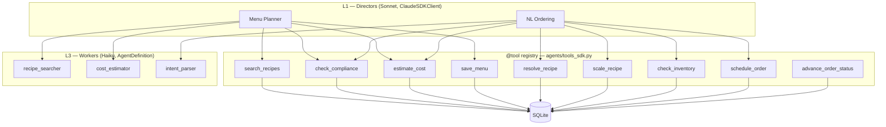
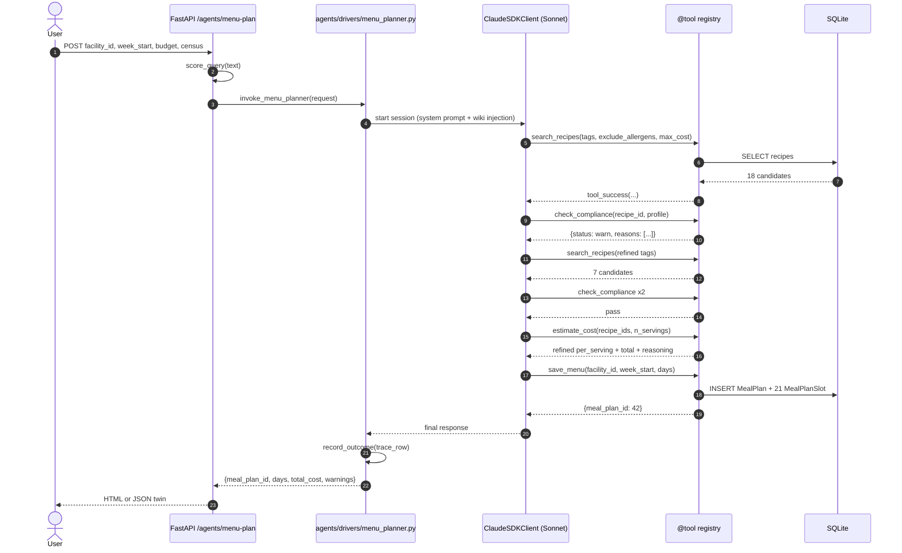
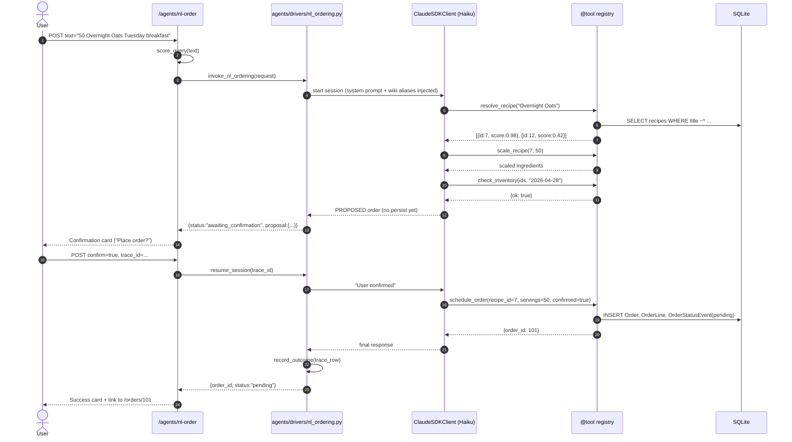

# ds-meal — Agent Workflow

**Scope:** Phase 2 design document.
**Phase context:** App Phase 1 (synchronous dispatch, hand-clustered wiki compile, no embeddings). Phase 2 graduation seams are named in Section 10.

---

## 1. Purpose

This document specifies how the two agentic surfaces of ds-meal — the **Menu Planner** and the **Natural-Language Ordering** agents — run end-to-end. It is the runtime contract between:

- the FastAPI routes in `app/routes/agents.py`,
- the agent drivers in `agents/drivers/`,
- the Claude Agent SDK (`ClaudeSDKClient` for Directors, `AgentDefinition` for Workers, `@tool` for the tool registry),
- the tool registry in `agents/tools_sdk.py`, and
- the two-layer self-improvement substrate (SDK-native retry + Karpathy Auto-Research loop).

It covers who runs at which tier, which tools each agent can call, how the agents fail over, how every invocation is observed, how cross-task learning flows through the wiki, and how the Phase 1 design graduates cleanly to Phase 2 without a rewrite.

It does **not** contain Python — that is Phase 3. Diagrams, contracts, and narratives only.

---

## 2. Agent Hierarchy in ds-meal

ds-meal collapses DuloCore's four-tier ATOMIC-S hierarchy into a **2-tier minimum-viable** shape:

| Tier | Role | Model | Pattern | Max direct tool calls |
|------|------|-------|---------|-----------------------|
| **L1 Director** | Entry point, decomposes goal, calls workers/tools | Sonnet | `ClaudeSDKClient` (stateful, multi-turn) | 1 |
| **L3 Worker** | Executes a single atomic skill | Haiku | `AgentDefinition` subagent | unlimited |

There are exactly two L1 Directors (**Menu Planner**, **NL Ordering**). They share the same L3 Worker pool and the same `@tool` registry. L0 Supervisor and L2 Manager tiers are intentionally skipped — prototype concurrency stays ≤ 4 workers, so no mid-tier arbiter is needed.

**Dietary compliance is a `@tool`, not a standalone agent.** Both Directors call it. This keeps compliance logic in one place and avoids a cross-agent delegation hop that would add latency and tokens for a deterministic check.

L3 Workers are optional inside each turn — the Director may call a `@tool` directly for simple cases or delegate to a Haiku worker for multi-step sub-tasks. The choice is the Director's; the SDK records which path was taken in the trace.

---

## 3. Menu Planner Agent Workflow

**Purpose.** Given a `facility_id`, a `week_start` date, a **dietary flag census**, a **weekly budget**, and a **headcount**, build a 7-day menu (21 slots) that passes compliance for the resident mix and lands within budget. Persist as a `MealPlan` + `MealPlanSlot` rows.

**Model.** Sonnet. **Pattern.** `ClaudeSDKClient`, stateful multi-turn.

**Typical tool rounds: 6.**
- `search_recipes` × 2 — initial candidate pool, then refinement after compliance failures.
- `check_compliance` × 3 — once per meal tranche (breakfast / lunch / dinner) against the census.
- `estimate_cost` × 1 — rollup pricing for the full 7-day plan, LLM-refined for bulk scale.
- `save_menu` × 1 — persists `MealPlan` + 21 `MealPlanSlot` rows.

**Failure paths.**
- **`check_compliance` fails for every candidate in a tranche.** Director returns a partial plan with an explicit "clarification needed" turn asking the user whether to relax a flag or widen the allergen list. Never silently produces a non-compliant menu.
- **`estimate_cost` returns `tool_error`.** Director falls back to **static pricing** — sums `Recipe.cost_cents_per_serving × n_servings` — and adds `pricing_mode: "static_fallback"` to the response.
- **`save_menu` uniqueness conflict** (plan already exists for facility + week). Returned as `tool_error` with existing `meal_plan_id`; Director asks whether to overwrite.

**Observability.** Each invocation writes one row to `agent_trace` (SQLite) and one JSONL line to `logs/agent_trace.jsonl`. Row shape: `trace_id`, `agent_name`, `model`, `started_at`, `duration_ms`, `tools_called`, `input_tokens`, `output_tokens`, `cost_usd`, `outcome`, `meal_plan_id`. Full payloads to `logs/agent_payloads/{trace_id}.json`.

**Expected cost per call: ~$0.06** (Sonnet, ~6 tool rounds, ~6k in / ~1.5k out).

---

## 4. NL Ordering Agent Workflow

**Purpose.** Parse free-text order intent like `"50 Overnight Oats for Tuesday breakfast"` into a structured `Order` + `OrderLine` + `OrderStatusEvent(pending)`. User must explicitly confirm before persistence — no silent writes.

**Model.** Haiku. **Pattern.** `ClaudeSDKClient`, stateful with an **explicit confirmation turn**.

**Typical tool rounds: 4.**
- `resolve_recipe(name_query)` — fuzzy lookup, returns top-3 candidates with scores.
- `scale_recipe(recipe_id, n_servings)` — pure, computes scaled ingredient grams.
- `check_inventory(ingredient_ids, needed_by)` — stubbed in Phase 1 (always "ok"); real sync is a Phase 2 seam.
- `schedule_order(recipe_id, servings, service_date, confirmed=True)` — only after user confirmation.

**Failure paths.**
- **Ambiguous recipe name.** Director presents top-3 candidates as a clarification turn.
- **Inventory shortage.** Director calls `search_recipes` with the blocking ingredient excluded, presents 2–3 alternatives.
- **`schedule_order` idempotency conflict.** Director tells user "you already have that order — want to increase quantity?"

**Observability.** Identical trace row shape. `outcome` adds `disambiguation` and `awaiting_confirmation` variants. This lets the wiki compiler notice learnable patterns like "facility X always picks candidate 2 when 'oats' is ambiguous."

**Expected cost per call: ~$0.003** (Haiku, ~4 rounds, ~1k in / ~300 out).

---

## 5. @tool Contract

Each tool returns `tool_success(data: dict)` or `tool_error(code, message, hint?)`. Error codes are enumerated.

- **`search_recipes(tags, exclude_allergens, max_cost_cents?, texture_level?)`** — Success: `{recipes: [...], count}`. Error: `no_match`, `invalid_tag`.
- **`check_compliance(recipe_id, resident_profile_id | census)`** — Deterministic dietary-flag matcher. Success: `{status, flags_checked, reasons}`. Error: `recipe_not_found`, `profile_not_found`.
- **`estimate_cost(recipe_id, n_servings, context?)`** — LLM-refined pricing. Success: `{per_serving_cents, total_cents, reasoning, pricing_mode}`. Error: `llm_unavailable` (caller falls back to static).
- **`save_menu(facility_id, week_start, days)`** — Persists MealPlan + 21 slots. Success: `{meal_plan_id, n_slots}`. Error: `duplicate_plan`, `invalid_slot`.
- **`resolve_recipe(name_query, top_k=3)`** — Fuzzy title match. Success: `{candidates, best_confidence}`. Error: `no_match`.
- **`scale_recipe(recipe_id, n_servings)`** — Pure, no LLM. Success: `{recipe_id, n_servings, ingredients}`. Error: `recipe_not_found`.
- **`check_inventory(ingredient_ids, needed_by)`** — Phase 1 stub `{ok:true}`. Success: `{ok, shortages}`. Error: `invalid_date`.
- **`schedule_order(recipe_id, servings, service_date, confirmed)`** — Idempotent on `(recipe_id, service_date, facility_id)`. Success: `{order_id, status: "pending"}`. Error: `duplicate_order`, `not_confirmed`.
- **`advance_order_status(order_id, new_status, note?)`** — Writes `OrderStatusEvent`, enforces state-machine transitions. Success: `{order_id, from_status, to_status, event_id}`. Error: `invalid_transition`, `order_not_found`.

Every tool opens its own async DB session — no shared session across calls. Routes **never** touch the DB directly.

---

## 6. Claude Agent SDK Native Self-Healing (Layer 1)

Layer 1 is what the Claude Agent SDK does **automatically**, with zero custom code. Intra-task recovery within a single invocation.

- **Tool retry.** On transient `@tool` failure, SDK re-invokes the tool up to a configurable count. Configured `retry=3` per tool.
- **Automatic model escalation.** When a Haiku agent fails twice in a row to make forward progress, SDK can escalate the next turn to Sonnet. `escalation=true` on `NL Ordering`; Menu Planner is already Sonnet. Escalation logged to the trace row.
- **Timeout handling.** Per-turn and per-session deadlines fail fast; retry kicks in; exhaustion returns a structured `tool_error`.
- **Tool-result marshaling.** `tool_success` / `tool_error` shapes enforced by the SDK; malformed returns raise at the SDK boundary.

**Configuration knobs (on `ClaudeSDKClient` init):** `retry=3`, `escalation=true`, `per_turn_deadline_ms=45000`, `session_deadline_ms=180000`, `max_turns=12`.

---

## 7. Karpathy Auto-Research Loop (Layer 2)

Layer 2 is what **we** build — **cross-task longitudinal learning**. Each agent invocation ends with `record_outcome()` writing one row to `agent_trace`. Periodically (on-demand in Phase 1, nightly cron in Phase 2), `wiki/compiler.py` reads recent traces, groups by pattern, uses Haiku to synthesize topic pages. Those pages are injected into the next session's system prompt.

**Loop steps.**
1. **Record.** `agents/observability.py::record_outcome(trace_row)` appends to `agent_trace` + JSONL log.
2. **Cluster.** `wiki/compiler.py::cluster_traces()` groups by `(agent_name, pattern_key)`. Phase 1: hand-derived. Phase 2 seam: MiniLM cosine similarity.
3. **Synthesize.** Haiku call per cluster with type-aware prompt → Markdown topic page with YAML frontmatter.
4. **Write.** `wiki/topics/{agent_name}/{topic_slug}.md`.
5. **Index.** `wiki/TOPICS-INDEX.md` regenerated from filesystem each compile.
6. **Inject.** `.claude/hooks/wiki_session_inject.py` reads index, picks relevant pages, prepends to Director system prompt.

See `docs/workflows/KARPATHY-AUTO-RESEARCH-WORKFLOW.md` for the full protocol.

---

## 8. Fallback Behavior When LLM Unavailable

**The route never crashes** when `ANTHROPIC_API_KEY` is missing, revoked, or rate-limited.

- **Menu Planner fallback.** Deterministic recipe-picker in `app/services/menu_fallback.py`: reads facility census, queries recipes ordered by cost ASC, filters by allergen + texture deterministically, fills 21 slots round-robin, persists with `pricing_mode: "static_fallback"` and a visible UI badge.
- **NL Ordering fallback.** Returns an error card directing user to `/orders/new?mode=form` (structured form, always available). Does not attempt to guess intent.
- **Detection.** Driver catches `AnthropicAPIError`, `AuthError`, 429s at the `ClaudeSDKClient.query()` boundary; logs a `fallback_invoked` trace row; returns the fallback response.

**Invariant:** a user request never returns 500 because of the LLM.

---

## 9. Exploration Depth Scoring at Agent Entry

Before each Director invocation, the route calls `agents/depth_scorer.py::score_query(text) -> (level, n_agents, shape)`. 6-dimension rubric; total maps to dispatch level.

**Phase 1 behavior.** If `total_score >= 7`, the router **logs** `should_decompose=true` on the trace row. It does **not** decompose — same single-Director path runs. Telemetry without complexity.

**Phase 2 escalation path.** Seam: `agents/depth_scorer.py::should_decompose()`. Flip from "log only" to "actually decompose" → a score ≥ 7 triggers a pre-flight decomposition pass (cheap Haiku call) that splits the user request into N sub-goals, each dispatched to a separate Director session, then recomposed.

NL order typically scores 2–4. Menu plan typically scores 5–6. Score ≥ 7 would be "re-plan all five facilities for the next month" — explicitly out of Phase 1 scope.

---

## 10. Phase 2 Graduation

Each subsystem named here has exactly one seam where Phase 2 code plugs in.

| Subsystem | Phase 1 | Seam | Phase 2 |
|---|---|---|---|
| Wiki compilation trigger | `make compile-wiki` | `wiki/compile_timer.py` | 24-hour systemd cron |
| Trace clustering | Hand-derived pattern keys | `wiki/compiler.py::cluster_traces()` | MiniLM embeddings + vector clustering |
| Wiki gap detection | Implicit (none) | new `wiki/graph.py` | Neo4j or lighter graph-KB for gap detection + self-improvement |
| Wiki quality | No lint | `wiki/lint.py` | 7-point lint (contradictions, staleness, orphans, etc.) |
| Agent dispatch | Sync in-process | `agents/drivers/dispatch()` | Inngest event bus |
| Depth-score response | Log only | `agents/depth_scorer.py::should_decompose()` | Actually decompose + fan out |
| Inventory check | Stub `{ok:true}` | `@tool check_inventory` | Real ERP / supplier sync |
| Auth / RBAC | Single-admin allowlist | `require_login` dependency | Multi-facility RBAC with roles |
| Frontend | Jinja templates | `/api/v1/*` JSON twins | React/Angular SPA |

Every row is a one-file or one-function change in Phase 2. The Phase 1 shape doesn't need to be undone.

---

## 11. Files Implied by This Workflow

- `agents/drivers/menu_planner.py` — Menu Planner Director (Sonnet, 6-turn budget, fallback hook)
- `agents/drivers/nl_ordering.py` — NL Ordering Director (Haiku, 4-turn budget, confirmation gate)
- `agents/drivers/dispatch.py` — shared invoke + trace-wrap helper; the one place Phase 2 swaps sync for Inngest
- `agents/tools_sdk.py` — 9 `@tool` wrappers; single DB gateway for all agent work
- `agents/tools.py` — pure async DB helpers (no `@tool` decorator)
- `agents/llm_client.py` — thin `query()` wrapper for one-shot Haiku calls (used by wiki compiler)
- `agents/depth_scorer.py` — 6-dimension `score_query` + `should_decompose` seam
- `agents/observability.py` — `record_outcome()` + JSONL + SQLite `agent_trace` writer
- `agents/prompts/menu_planner.md` — Menu Planner system prompt
- `agents/prompts/nl_ordering.md` — NL Ordering system prompt
- `app/services/menu_fallback.py` — deterministic recipe-picker for no-LLM case
- `app/routes/agents.py` — FastAPI handlers (HTML + `/api/v1/` JSON twins)
- `wiki/compiler.py` — reads traces, clusters, calls Haiku, writes topic pages
- `wiki/index_generator.py` — regenerates `wiki/TOPICS-INDEX.md`
- `wiki/topics/{agent_name}/*.md` — compiled topic pages with YAML frontmatter (generated)
- `wiki/TOPICS-INDEX.md` — only retrieval mechanism in Phase 1
- `.claude/hooks/wiki_session_inject.py` — session-start wiki injection
- `logs/agent_trace.jsonl` — append-only JSONL trace log
- `logs/agent_payloads/{trace_id}.json` — full per-call payloads
- `Makefile` target `compile-wiki` — Phase 1 trigger
