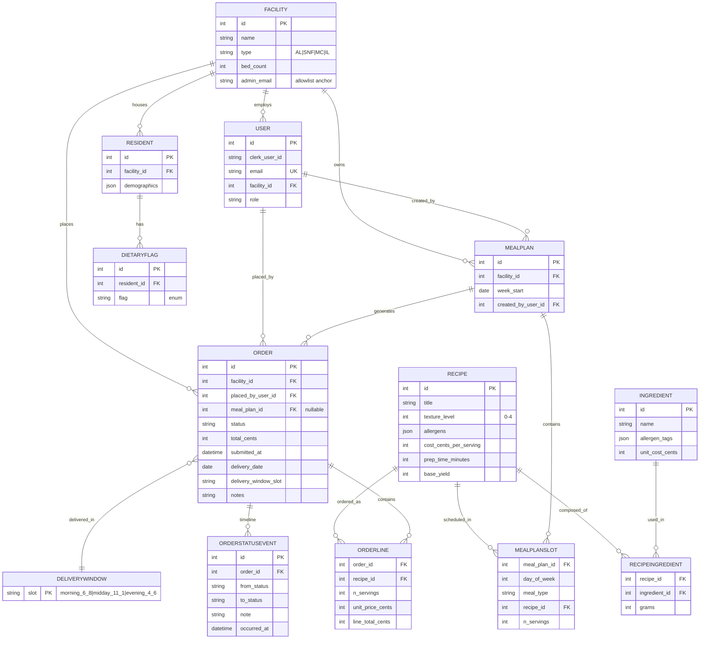
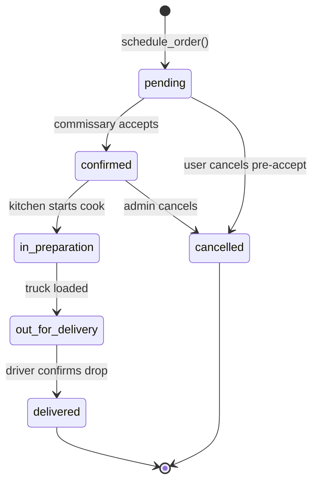
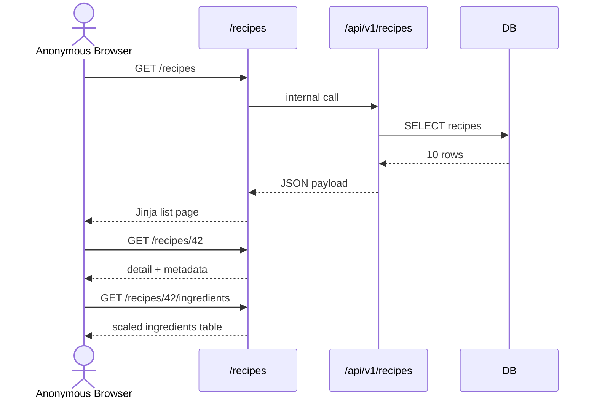
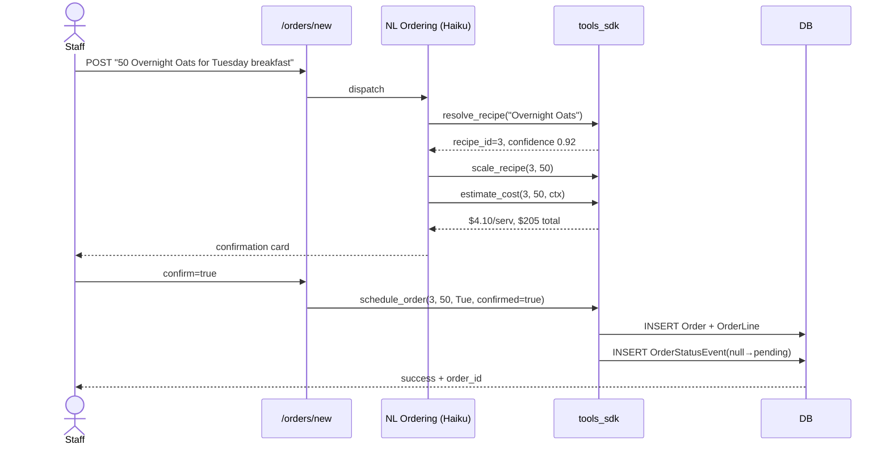

# DOMAIN WORKFLOW — ds-meal Phase 1

## 1. Purpose

This document describes **what happens inside ds-meal at the domain level** — the entities, state transitions, user journeys, and business rules that define a meal-ordering prototype for senior-living facilities. It is the bridge between the protocol-level architecture docs (`docs/systems/*`) and the file-level pseudocode (Phase 3).

**This doc IS:** the canonical source for entity relationships, order state machine, user flows, dietary compliance rules, pricing logic, calendar mechanics, and seed data narrative. A Direct Supply interviewer reading this cold should understand ds-meal's domain without needing code.

**This doc is NOT:** a file-level implementation plan, pseudocode, API spec, or UI mockup. Those live elsewhere. It also does not prescribe hook enforcement, agent internals, or deployment topology — all referenced by link only.

Every section ends with or feeds into a **Phase 2 Graduation** note (Section 9) so the App Phase 1 / App Phase 2 seam is visible per the Two-Horizon Rule.

---

## 2. Entity-Relationship Diagram

**Cardinality notes.** Facility is the tenancy root; every Order, Resident, MealPlan, and User fans out from it. OrderStatusEvent is append-only — a given Order accumulates one row per transition. MealPlan → Order is 1:N because one weekly plan generates up to seven daily orders (one per delivery day).

---

## 3. Order Status State Machine

| Transition | Guard | Side effect |
|---|---|---|
| `(none) → pending` | `schedule_order()` succeeds; order row inserted | OrderStatusEvent row `from=null, to=pending` |
| `pending → confirmed` | caller has admin role; commissary capacity check passes (stub) | OrderStatusEvent |
| `pending → cancelled` | order is still `pending`; optional note required | OrderStatusEvent, `total_cents` frozen |
| `confirmed → in_preparation` | `delivery_date - now ≤ 24h` | OrderStatusEvent |
| `confirmed → cancelled` | admin role; `delivery_date - now ≥ 6h` | OrderStatusEvent |
| `in_preparation → out_for_delivery` | on or after `delivery_date` @ 5 AM | OrderStatusEvent |
| `out_for_delivery → delivered` | driver/admin confirms | OrderStatusEvent terminal |
| any → `cancelled` after `in_preparation` | **rejected** | — |

All transitions flow through a single service function `advance_order_status(order_id, new_status, note)` that (a) validates guard, (b) updates `Order.status`, (c) appends an OrderStatusEvent row, (d) returns the updated order. No other code path is allowed to mutate `Order.status`.

---

## 4. User Journeys

### J1 — Anonymous recipe browse (kata baseline)

No auth. Satisfies the original kata requirement. Static `cost_cents_per_serving` rendered directly — no LLM.

### J2 — Admin sign-in (Clerk Google)

1. Anonymous user clicks **Sign In** in the nav.
2. `/sign-in` 302s to the Clerk-hosted page; Google is the only provider.
3. Ivan authenticates as `admin@dulocore.com`.
4. Clerk redirects back to `/sign-in/callback` with a session JWT.
5. Provisioning middleware: verify JWT via JWKS → look up `Facility` by `admin_email` → match = `Riverside SNF` → `INSERT INTO user` (first-time) or load existing.
6. Redirect to `/facility/dashboard`, which renders active orders, next delivery, quick-reorder tiles.

Allowlist is enforced both at the Clerk webhook (`user.created` event) and at every gated request.

### J3 — Dietitian invokes Menu Planner agent

1. User at `/meal-plans/new` types goal: *"Plan next week for 120 residents; honor dietary mix; target <$5/serving."*
2. Route handler calls `score_query()` (6-dim depth scorer) → classifies as `moderate` → dispatches a Sonnet `ClaudeSDKClient`.
3. The Menu Planner agent loops through ~6 tool rounds: `search_recipes()` → `check_compliance(recipe_id, facility_profile)` on each candidate → `estimate_cost(recipe_id, 120, context)` for refined per-serving pricing → `save_menu()` on confirmation.
4. UI streams a 7-day × 3-meal grid. Each slot shows compliance badges (green/amber/red) and narrative reasoning from the LLM.
5. User clicks **Save**: writes one `MealPlan` + up to 21 `MealPlanSlot` rows.
6. Post-save hook: MealPlan generates daily Orders. For each unique `day_of_week`, group slots → create one `Order` + N `OrderLine` rows → emit `pending` status event. Orders appear in J5 history.

### J4 — NL order from kitchen staff

Agent is idempotent on `(recipe_id, delivery_date)` — re-submitting the same phrase returns the existing order_id rather than duplicating.

### J5 — Order history, detail, calendar

1. **History** `/orders`: paginated table, default 25/page, filter by `status` via query string (`?status=in_preparation`). Each row shows a colored status badge (partial `_partials/status_badge.html`).
2. **Detail** `/orders/{id}`: top = OrderLine breakdown with unit/line prices; middle = vertical timeline generated from OrderStatusEvent rows (oldest at bottom); bottom = 6-segment progress bar tracking current status.
3. **Calendar** `/calendar?year=2026&month=04`: month grid rendered via stdlib `calendar.monthcalendar()`. Orders whose `delivery_date` falls in the month render as cells with a status-colored dot and the order_id. Prev/next navigation via query string; today's cell highlighted.

---

## 5. Dietary Compliance Logic

All six rules below are **deterministic Python functions** in `app/services/compliance.py`. The Menu Planner agent calls these as `@tool` wrappers and **adds narrative reasoning** on top — the LLM never overrides a deterministic fail. Fail = hard no. Warn = advisory. Pass = clear.

| Flag | Inputs | Decision logic | Output |
|---|---|---|---|
| `diabetic` | `recipe.carbs_g`, `resident.max_carbs_per_meal` (default 60 g) | `carbs_g > cap` → fail; within 10% of cap → warn; else pass | `{verdict, rule, actual, cap}` |
| `low_sodium` | `recipe.sodium_mg`, cap 600 mg | `sodium_mg > cap` → fail; within 15% → warn | same shape |
| `renal` | `recipe.potassium_mg` (cap 800) + `phosphorus_mg` (cap 250) | either over → fail; either within 10% → warn | same shape, reports both minerals |
| `soft_food` | `recipe.texture_level`, required ≤ 2 | `texture_level > 2` → fail | same shape |
| `pureed` | `recipe.texture_level`, required ≤ 1 | `texture_level > 1` → fail | same shape |
| `allergen_*` | `recipe.allergens[]`, `resident.allergen_flags[]` | any intersection → fail, name the allergen(s) | `{verdict, matched_allergens}` |

**Aggregation.** `check_compliance(recipe_id, resident_id)` runs every rule implied by the resident's flags and returns the worst verdict (`fail > warn > pass`) plus the per-rule breakdown. When called against a **facility profile** (J3), the function runs against each resident and rolls up: a recipe "fails" for the facility if it fails for any resident; "warns" if it warns for ≥10% of residents.

**LLM role.** The Menu Planner receives the deterministic verdict + breakdown as a `@tool` result, then adds a narrative paragraph ("This meal fails renal restrictions due to potassium load — consider substituting sweet potato with white rice"). The narrative is advisory; the verdict is law.

---

## 6. Pricing Workflow

Two paths, one service module (`app/services/pricing.py`).

**Browsing path (static, zero LLM cost):**
- Inputs: `recipe_id`, optional `n_servings` (default = `base_yield`).
- Function: `static_rollup(recipe_id, n_servings) → {per_serving_cents, total_cents}`.
- Called by `/recipes`, `/recipes/{id}`, `/orders` history, `/calendar`. Renders instantly with seeded data.

**Agent path (hybrid, LLM narrative):**
- Function signature: `estimate_cost(recipe_id, n_servings, context) → {per_serving_cents, total_cents, reasoning, source}`.
- Call sequence: (1) load static baseline via `static_rollup()`; (2) call a Haiku `query()` with baseline + `context` (facility, bulk-scale hint, season); (3) LLM returns a refined per-serving price + reasoning ("at 120 servings, bulk pricing reduces per-serving by 12%"); (4) if LLM errors or refinement deviates >30% from baseline, `source="static"` and the baseline wins. Otherwise `source="llm_refined"`.
- `source` is persisted on `OrderLine` alongside `unit_price_cents` so the pricing origin is always auditable.

The Menu Planner and NL Ordering agents call `estimate_cost` via `tools_sdk`. Plain route renders never do.

---

## 7. Calendar View Logic

1. Route `/calendar` accepts `?year=&month=` (both default to today).
2. `calendar.monthcalendar(year, month)` returns a `list[list[int]]` — rows of weeks, zero for days outside the month.
3. SQL: `SELECT * FROM "order" WHERE delivery_date BETWEEN first_day AND last_day AND facility_id = :me`.
4. Build a `dict[date, list[Order]]` keyed by `delivery_date`.
5. Jinja iterates the month-grid rows; for each non-zero day, looks up orders in the dict and renders colored dots per status (6 statuses = 6 CSS classes).
6. Prev/next nav: `?year={y}&month={m-1}` (wrap year as needed).
7. Today's date gets a `.today` class for visual highlight.

Pure stdlib + pure SQL + Jinja. No JS. No library.

---

## 8. Seed Data Narrative

The seed covers five facilities of mixed type: **Oakwood Manor** (Assisted Living, 80 beds), **Riverside SNF** (Skilled Nursing, 120 beds — the sole admin-bound facility, tied to `admin@dulocore.com`), **Cedar Pines Memory Care** (45 beds), **Harbor View** (Independent Living, 150 beds), and **Sunset Village SNF** (90 beds). Only Riverside has `admin_email` set; the rest exist to make dashboards, roll-ups, and future multi-tenant demos plausible. Residents (~30 total, weighted 60/40 toward Riverside and Sunset since they are skilled nursing) carry realistic dietary-flag mixes: diabetic + low_sodium is the most common pair, renal + pureed is rare but critical, and allergen flags are scattered individually.

The ten recipes combine the three kata baselines (Chicken Stir-Fry, Overnight Oats, Tomato Basil Soup) with seven senior-appropriate additions: Baked Cod + Rice, Beef Stew, Pureed Chicken + Sweet Potato, Turkey Meatloaf, Lentil Soup, Fruit & Yogurt Parfait, and Shepherd's Pie. Each has a texture_level 0–4, an allergen list, and a static per-serving cost in the $2.50–$6.00 range typical of institutional senior-care food. Five demo orders pre-seed Riverside's dashboard so the first login is never empty: one `delivered` order last week (Chicken Stir-Fry × 60), one `out_for_delivery` today (Overnight Oats × 120), one `in_preparation` for tomorrow (Beef Stew × 80), one `confirmed` three days out from a multi-line MealPlan, and one `pending` submitted this morning. Each carries a realistic OrderStatusEvent history with timestamps staggered across days, so the timeline UI has content from frame one.

---

## 9. Phase 2 Graduation

Per the Two-Horizon Rule, every workflow above has a Phase-1 form and a named seam for Phase 2.

| Workflow | Phase 1 (ships) | Seam | Phase 2 (extends) |
|---|---|---|---|
| Order status transitions | `advance_order_status()` writes an `OrderStatusEvent` row synchronously | `services/orders.py::advance_order_status()` body | Emit an Inngest event; downstream handlers fan out to kitchen, logistics, notifications |
| MealPlan → Order generation | Synchronous loop in the save handler | `services/orders.py::generate_from_meal_plan()` | Inngest-scheduled generator running nightly at midnight |
| Dietary compliance | Pure Python functions + LLM narrative | `services/compliance.py` rule functions | Add machine-learned renal risk score, user-tunable cap overrides per resident |
| Pricing refinement | Static baseline + optional LLM wrapper | `services/pricing.py::estimate_cost()` | Supplier ERP sync for real unit costs; replace `static_rollup()` body |
| Calendar | Server-rendered month grid, stdlib only | `services/calendar_view.py` | FullCalendar.js or React component consuming `/api/v1/calendar` (JSON twin already exists) |
| Auth allowlist | Clerk single-admin, `Facility.admin_email` match | `auth/dependencies.py::require_login` | Multi-tenant RBAC with role tables and per-facility scoping |
| Agent dispatch | Synchronous in-process `ClaudeSDKClient` | `agents/drivers/dispatch()` | Inngest event bus for durable agent runs |
| Seed data | `scripts/seed_db.py` from JSON fixtures | `fixtures/*.json` | Admin UI for CRUD of facilities/recipes/residents |

**Trigger conditions.** Phase 2 begins for any given row when (a) concurrency exceeds 4 simultaneous agent calls, (b) a second facility admin onboards, (c) real supplier data becomes available, or (d) state-change events need to reach external systems. Until any trigger fires, Phase 1 is sufficient.

---

## 10. Files This Workflow Implies

**Python modules:**

- `app/models/facility.py` — Facility + DeliveryWindow enum
- `app/models/resident.py` — Resident, DietaryFlag enum + join
- `app/models/recipe.py` — Recipe, Ingredient, RecipeIngredient
- `app/models/meal_plan.py` — MealPlan, MealPlanSlot
- `app/models/order.py` — Order, OrderLine, OrderStatusEvent, status enum
- `app/models/user.py` — User bound to Facility via clerk_user_id
- `app/services/compliance.py` — deterministic dietary-flag matcher (Section 5)
- `app/services/pricing.py` — static_rollup + estimate_cost hybrid (Section 6)
- `app/services/orders.py` — state machine, `advance_order_status`, `generate_from_meal_plan`
- `app/services/scaling.py` — pure ingredient-gram scaling for recipe detail
- `app/services/calendar_view.py` — month-grid builder using stdlib calendar (Section 7)
- `app/routes/recipes.py` — J1 browse endpoints
- `app/routes/facility.py` — post-sign-in dashboard (J2)
- `app/routes/meal_plans.py` — J3 Menu Planner UI + save
- `app/routes/orders.py` — J4 NL order, J5 history + detail
- `app/routes/calendar.py` — J5 month grid
- `app/routes/agents.py` — agentic dispatch endpoints
- `agents/tools_sdk.py` — @tool wrappers for every service function
- `agents/drivers/menu_planner.py` — Sonnet ClaudeSDKClient (J3)
- `agents/drivers/nl_ordering.py` — Haiku ClaudeSDKClient (J4)
- `scripts/seed_db.py` — loads Section 8 seed narrative from fixtures

**Jinja templates:**

- `templates/base.html` — nav, sign-in/out state
- `templates/recipes/{list,detail,ingredients}.html` — J1
- `templates/facility/dashboard.html` — J2 landing
- `templates/meal_plans/{list,new}.html` — J3 wizard
- `templates/orders/{list,detail,new}.html` — J4, J5
- `templates/calendar/month.html` — J5 grid
- `templates/_partials/{status_badge,timeline,progress_bar}.html` — shared order widgets
