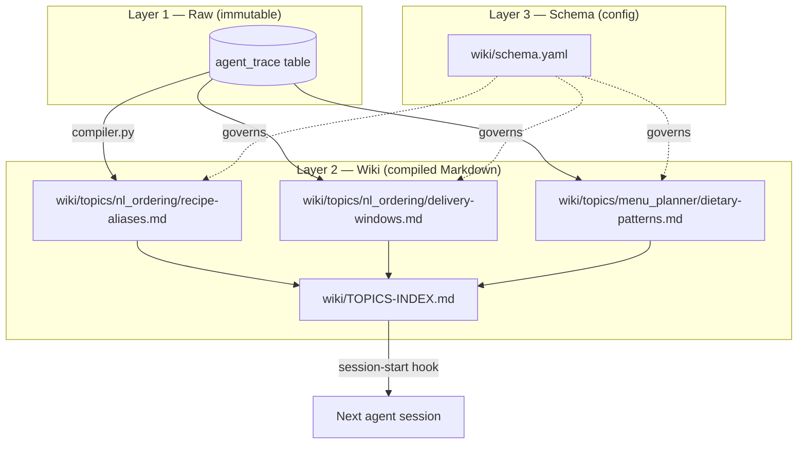
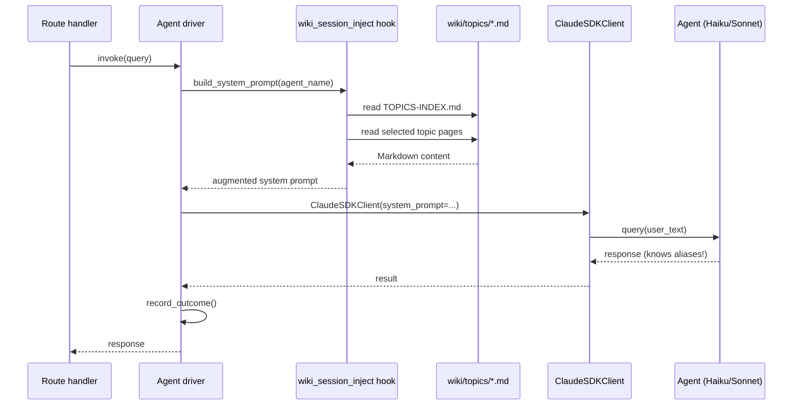

# Karpathy Auto-Research Loop — Workflow

**Status:** Phase 2 design spec. Phase 2-of-app graduation seams named inline.
**Owner:** MEAL Director (ds-meal).
**Scope:** Cross-task longitudinal learning for the NL Ordering and Menu Planner agents.
**Companion doc:** `docs/workflows/AGENT-WORKFLOW.md` (Layer 1 intra-task self-healing).

---

## 1. Purpose

The Karpathy Auto-Research Loop is ds-meal's **cross-task longitudinal learning** mechanism. It is the second of two complementary self-improvement altitudes.

- **Layer 1 — Intra-task self-healing (Claude Agent SDK native).** Single-call retry + Haiku→Sonnet escalation. Bounded to one invocation, handled by the SDK runtime. Zero custom code. Covered in `AGENT-WORKFLOW.md`.
- **Layer 2 — Cross-task longitudinal learning (this document).** After an invocation ends — success or not — the agent **emits a trace row**. Periodically a **compiler** reads traces, clusters by pattern, **synthesizes Markdown wiki pages** using Haiku. Those pages are **injected into the next session's agent context** via a session-start hook. The loop is:

```
agent runs → trace row → compiler clusters → Haiku synthesizes topic page → next session starts smarter
```

Layer 1 cannot teach an agent that this facility says "oats" when it means "Overnight Oats" — that knowledge requires a *population* of past calls. Layer 2 is how we derive it.

**Why ds-meal has this.** Senior-facility ordering is a domain of **institutional shorthand**: Riverside SNF's dietitian types "40 oats for tomorrow morning" — every day. Without the loop, the NL Ordering agent asks clarifying questions every time. With the loop, it learns the aliases after one compile cycle. That behavior — *agents that arrive at work already knowing how your facility talks* — is the Staff-level signal.

---

## 2. Three-Layer Architecture

ds-meal adopts DuloCore's Karpathy-inspired three-layer model verbatim, because conflating the layers reproduces the exact anti-pattern DuloCore's deprecation of tiered PMO was meant to kill.

- **Layer 1 — Raw.** `agent_trace` SQLite table. Immutable, append-only. One row per invocation. The ground truth.
- **Layer 2 — Wiki.** Human-readable Markdown topic pages compiled from Layer 1 via Haiku. Located at `wiki/topics/{agent_name}/*.md`. YAML frontmatter + synthesized body. Re-compiled on demand (Phase 1) or nightly (Phase 2-of-app).
- **Layer 3 — Schema.** `wiki/schema.yaml`. Compilation configuration: cluster threshold, type-aware synthesis strategies, lint rules. Changing this file changes how Layer 2 gets produced — without touching Layer 1 or the compiler code.



Three layers, three responsibilities, three rates of change: Layer 1 changes every agent call; Layer 2 changes every compile; Layer 3 changes when we rethink compilation strategy.

---

## 3. SQLite Schema (Layer 1)

The `agent_trace` table lives in `/app/data/ds-meal.db`.

| Column            | Type       | Notes |
|-------------------|------------|-------|
| `id`              | INTEGER PK | Autoincrement. Trace identity. |
| `ts`              | TEXT       | ISO-8601 UTC at end of invocation. |
| `agent_name`      | TEXT       | `nl_ordering`, `menu_planner`, etc. |
| `query_text`      | TEXT       | User input that initiated the call. Free-form. |
| `tool_calls_json` | TEXT       | JSON array of `{tool, args, result_summary}`. |
| `outcome`         | TEXT       | Enum: `success` / `failure` / `partial`. |
| `confidence_score`| REAL       | Agent's self-reported 0.0–1.0 confidence. |
| `latency_ms`      | INTEGER    | End-to-end wall-clock. |
| `cost_cents`      | INTEGER    | Sum of Anthropic token costs. |
| `notes`           | TEXT       | Free-form agent commentary (e.g., escalation reason). |

Index: `CREATE INDEX idx_agent_trace_name_ts ON agent_trace(agent_name, ts DESC)`. This is the only index needed — every compile query is "last N rows for agent X ordered by ts descending."

Created by `app/db/init_schema.py` at app startup. **Never** touched by the main application beyond INSERT by the outcome recorder. **Only** read by the wiki compiler.

---

## 4. Outcome Recording (Ingest)

At the end of every agent invocation, the driver calls a single `record_outcome()` function (~30 lines in Phase 1).

**What it does:**
1. Receives the invocation summary: agent, query, serialized tool calls, outcome, confidence, latency, cost.
2. Opens a short-lived SQLite session.
3. Writes one row into `agent_trace`.
4. Commits and closes.
5. Returns.

**When it fires.** Called from `agents/drivers/nl_ordering.py` and `agents/drivers/menu_planner.py` in a `finally` block — so it records **successes, failures, and exceptions alike**. Layer 1 is genuinely complete.

**What it does NOT do.** No clustering, no embedding, no LLM calls, no analysis. Pure ingestion. Keeping it dumb is what keeps it cheap (sub-millisecond) and reliable (cannot fail in ways that break the agent).

**App-Phase 2 note:** two new columns via Alembic migration — `embedding BLOB` (serialized 384-dim MiniLM vector of `query_text`) and `related_trace_ids TEXT` (JSON list of top-5 cosine-similar prior traces). Seam: `record_outcome()` grows an embedding step.

---

## 5. On-Demand Compilation (Phase 1) → Nightly Cron (Phase 2)

**Phase 1 trigger:** `make compile-wiki`. Explicit, debuggable, no moving parts.

**Phase 2-of-app trigger:** systemd timer fires every 24h at 03:00 local. Same script, different entry point.

**Script:** `wiki/compiler.py`.

**Algorithm:**
1. **Load schema.** Read `wiki/schema.yaml`.
2. **For each agent in `agent_trace`:**
   1. Read last N traces: `SELECT * FROM agent_trace WHERE agent_name = ? ORDER BY ts DESC LIMIT 100`.
   2. **Cluster.**
      - *Phase 1:* hand-clustering on normalized `query_text` tokens + `tool_calls_json` shape.
      - *Phase 2:* MiniLM cosine similarity + agglomerative clustering.
      - **Seam:** `wiki/compiler.py::cluster_traces(traces) -> list[Cluster]`. Swap body, keep signature.
   3. For each cluster with size ≥ threshold (default 3):
      1. Classify cluster's memory type (feedback / project / reference / user) from agent notes + tool signatures.
      2. Pull synthesis strategy from `schema.yaml` (rule-list, narrative, link-card, profile).
      3. Send cluster's traces + type-aware synthesis prompt to Haiku with strict Markdown-output instruction.
      4. Parse response. Validate YAML frontmatter.
      5. Write to `wiki/topics/{agent_name}/{slug}.md`. Atomic overwrite (tempfile + rename).
3. **Regenerate index.** Invoke `wiki/index_generator.py`.
4. **Emit cost summary.** Log compile duration and total Haiku cost to stdout.

**Cost.** Demo-scale compile (~2 agents, ~100 traces each, ~5 clusters/agent) = ~10 Haiku calls × ~1500 tokens ≈ **$0.015/compile**. Phase 2 nightly cron for a year ≈ $5.50.

---

## 6. Topic Page Format

Every topic page has **required YAML frontmatter** and a synthesized body.

**Required fields:** `title`, `sources` (trace IDs), `related_topics`, `last_compiled` (ISO), `memory_types` (subset of feedback/project/reference/user), `confidence_score` (0.0–1.0).

**Body:** synthesized Markdown — NOT a concatenation of raw traces. Haiku extracts the *pattern* and expresses it as rules, tables, or narrative per the strategy.

**Example — a realistic page after 7 "oats" traces:**

```markdown
---
title: Recipe Resolution Aliases — Riverside SNF
sources: [112, 118, 124, 131, 137, 142, 149]
related_topics: [delivery-window-shorthands, portion-conventions]
last_compiled: 2026-04-22T03:00:14Z
memory_types: [reference, feedback]
confidence_score: 0.92
---

# Recipe Resolution Aliases — Riverside SNF

Across 7 recent orders, Riverside SNF's dietitian uses institutional shorthand for recipe names. The NL Ordering agent should resolve these directly without asking for clarification.

## Confirmed aliases

| Staff shorthand | Canonical recipe               | Notes                                     |
|-----------------|--------------------------------|-------------------------------------------|
| "oats"          | Overnight Oats                 | Always refers to breakfast slot.          |
| "eggs"          | Veggie Omelette                | Not scrambled; omelette is the default.   |
| "stew"          | Beef Stew                      | Unless modified by "lentil" or "veggie".  |
| "the soft one"  | Pureed Chicken + Sweet Potato  | Facility's lowest-texture staple.         |

## Resolution rule

When the user input contains one of the shorthand tokens above AND no other recipe-qualifying noun is present, bind directly to the canonical recipe with `confidence ≥ 0.85`. Confirm only quantity and delivery window, not recipe identity.

## Counter-examples (do NOT apply rule)

- "oats and berries parfait" — two-noun phrase; resolve via `search_recipes`.
- "stew meat" — ingredient, not a recipe; escalate to clarifier.
```

---

## 7. TOPICS-INDEX.md Auto-Generation

After every compile, `wiki/index_generator.py` scans `wiki/topics/**/*.md`, parses frontmatter, regenerates `wiki/TOPICS-INDEX.md` as a Markdown table.

**Columns:** topic title · file path · sources count · last_compiled · one-line description (first sentence of body).

**Why an index + LLM-picks-pages beats vector search at this scale.**

1. **Few pages.** ds-meal at demo scale has ~10 topic pages. Vector search is engineered for thousands-to-millions; overkill at ten.
2. **LLM judgment > cosine similarity for ambiguous relevance.** The session-start hook feeds the index to the agent and asks "which pages are relevant?" — the LLM reads titles and descriptions and picks 1–3. Judgment, not nearest-neighbor.
3. **Debuggability.** An index is a file. Open it. Read it. See what the agent sees. Vector similarity is a black box.

**Phase 2-of-app graduation:** when topic page count exceeds ~50 per agent, add a vector index alongside the Markdown index. Don't replace — augment. Seam: `wiki/index_generator.py::build_index()` grows an optional `build_vector_index()` companion step.

---

## 8. Session-Start Injection Hook

`.claude/hooks/wiki_session_inject.py`.

**What it does on session start:**
1. Identifies the agent being started from `ClaudeSDKClient` config.
2. Reads `wiki/topics/{agent_name}/` + the global `wiki/TOPICS-INDEX.md`.
3. If the driver knows which pages it needs (e.g., NL Ordering wants `recipe-aliases`), reads those topic files and prepends them verbatim to the system prompt.
4. Otherwise prepends the full index and relies on the agent's planning step to select relevant pages via follow-up reads.
5. Returns the augmented system prompt.

**Cache economics.** Injection happens **once per session**, at `ClaudeSDKClient` construction. Wiki content becomes part of the cached system prompt (cached tokens cost 10% of fresh tokens).



---

## 9. Concrete Demo Scenario — NL Ordering Agent Learning Cycle

This is the demo scenario.

**T=0 — Seed.** Before real invocations, `scripts/seed_traces.py` inserts **20 hand-authored synthetic trace rows** into `agent_trace` for `nl_ordering`. Realistic past-session records: `"40 oats for tomorrow morning"`, `"eggs for breakfast sunday"`, `"the soft one for the memory unit"`, with `tool_calls_json` showing the agent historically had to fall back to a clarifier and finally pick the right recipe. Disclosed, not hidden (see §11).

**T=1 — First compile.** Run `make compile-wiki`:
- Reads 20 seed traces for `nl_ordering`.
- Pattern-clusters into ~5 groups: spice/dish aliases (7), meal-type shorthands (4), portion shorthands (3), delivery-window shorthands (4), facility-specific phrasings (2).
- For each cluster above threshold, Haiku synthesizes.
- Writes 4 topic pages (one cluster below threshold, correctly skipped).
- Regenerates `TOPICS-INDEX.md`.
- Total cost: ~$0.015. Wall time: ~25 s.

**T=2 — First real call after compile.** Riverside SNF user navigates to `/orders/new` and types:

> "40 oats for tomorrow morning"

Route handler invokes the NL Ordering driver. Session-start hook reads `nl_ordering` TOPICS-INDEX and prepends "Recipe Resolution Aliases — Riverside SNF" and "Delivery Window Shorthands" into the system prompt.

System prompt now contains "oats → Overnight Oats" and "tomorrow morning → `morning_6_8` + date=today+1." Agent matches both aliases, one tool-call round:

```
schedule_order(recipe_id=<Overnight Oats>, n_servings=40,
               delivery_date=<tomorrow>, delivery_window=morning_6_8,
               confirmed=True)
```

Confirmation to user: *"Scheduled 40 servings of Overnight Oats for tomorrow's morning delivery window (6–8 AM). Order #1204 pending."* Confidence: 0.91.

**T=3 — Loop closes.** Driver's `finally` calls `record_outcome()`. New row in `agent_trace` with the query, tool call, `outcome=success`, `confidence=0.91`, latency ~1.8 s, cost ~$0.0006. Next compile cycle incorporates this row; aliases page gets refined (sources list grows to 8).

**Before/after (the demo punchline).** Without the loop, "40 oats for tomorrow morning" sends the agent through a clarifier: "Did you mean Overnight Oats?" "What delivery window is 'morning'?" Extra round-trip, visible clarification. With the loop, direct resolve. *That gap is what Layer 2 buys.* Layer 1 cannot close it — no amount of retrying within one call teaches the agent what "oats" means here.

---

## 10. Schema YAML (Layer 3)

`wiki/schema.yaml`. Single configuration surface.

```yaml
version: 1

compilation:
  threshold: 3              # min traces per cluster to merit a topic page
  batch_size: 100           # max traces per agent per compile
  model: claude-haiku-4-5   # synthesis model
  max_topic_tokens: 1200    # hard cap per page

type_strategies:
  feedback:
    format: rule-list
    instruction: "Extract actionable rules the agent should follow next time."
  project:
    format: narrative
    instruction: "Describe the project's recurring patterns in 2-3 paragraphs."
  reference:
    format: link-card
    instruction: "Produce a short lookup table of alias -> canonical mappings."
  user:
    format: profile
    instruction: "Summarize the user's preferences and shorthand conventions."

lint:
  enabled: false            # Phase 1: disabled. Phase 2-of-app: 7-point suite.
```

---

## 11. Seeding Strategy — Phase 1 Honesty

**The honest problem:** the loop needs traces to compile. At T=0 there are no traces. Running compile against an empty table produces no wiki pages — demo's first agent call gets no benefit.

**The honest solution:** seed 20–30 synthetic trace rows per agent before demo day. Hand-authored by the developer to reflect realistic Riverside SNF patterns. Lives in `scripts/seed_traces.py`.

**Disclosed in the doc.** README's demo walkthrough and this workflow doc explicitly label the seed as "synthetic traces to bootstrap the loop for demo purposes." Ivan's narrative: *"At prototype scale the loop is seeded; at production scale it runs on organic volume."* That's a Staff-level answer.

**Phase 2 graduation — seed retires.** Once ds-meal runs for 14+ days with real traffic, organic rows dominate — synthetic seeds become noise. Seed script moves to `scripts/archive/`. **Trigger:** `SELECT COUNT(*) FROM agent_trace WHERE ts > date('now','-14 days')` > 200 per agent.

---

## 12. Phase 2 Graduation

Named seams + trigger conditions.

| Upgrade | Seam (Phase 1 file) | Trigger condition |
|---|---|---|
| **MiniLM embeddings replace hand-clustering** | `wiki/compiler.py::cluster_traces()` body swap | Trace count per agent > 500, where hand patterns miss >20% of obvious clusters by inspection |
| **Graph knowledge base (Neo4j or lighter) for gap detection** | new file `wiki/graph.py` | Topic page count > 20 per agent. Build a concept graph from topic-page entities + relations; detect orphan concepts (entity referenced but no topic page covers it) and contradictions; trigger *new* compile runs that target the gaps. Lighter-weight equivalents: [Kuzu](https://kuzudb.com/) (embedded, SQLite-flavored graph DB), Apache AGE on Postgres, or NetworkX in-memory for small graphs |
| **7-point lint suite** | new `wiki/lint.py` | Topic page count > 20 per agent, where duplicate/contradictory pages surface in review |
| **24-hour automatic systemd cron** | `wiki/compile_timer.py` + systemd `.timer` unit | App in genuine production use (at least one non-demo facility) |
| **Cross-director scaling** | directory layout: `wiki/topics/{director_id}/{agent_name}/` | Second director joins ds-meal |
| **Trace retention policy** | new `wiki/retention.py`, nightly job | `agent_trace` size > 100 MB. Keep last 6 months hot, archive older |

**The 7-point lint:** (1) duplicate topic pages, (2) contradictory rules across pages, (3) staleness (no source trace in last N days), (4) orphans (no session loaded this page), (5) broken links (references to non-existent related topics), (6) size violations (body > max_topic_tokens), (7) consistency drift (same alias mapped differently across two pages). Each produces a warning, not a block. Compile-report Markdown artifact.

**Graph KB detail.** Neo4j is the full-fat option but heavy (JVM, separate server). For a lighter footprint consistent with ds-meal's "single Python container + SQLite" stance, **Kuzu** (embedded graph DB, single file like SQLite) or a plain **NetworkX** in-memory graph persisted as JSON is sufficient for < 1000 concepts. Schema: nodes = concepts extracted from topic-page frontmatter + body entities; edges = `related_topics` links + entity co-occurrence. Gap detection query: "list nodes with degree=0 (orphans) or cited in `sources` but not owning a topic page." Those gaps feed a targeted Haiku re-compile that *writes the missing page*. This is the honest self-improvement loop: the system tells us what it doesn't know, and compiles the answer.

**The systemd unit** replaces `make compile-wiki` with:
```
[Timer] OnCalendar=*-*-* 03:00:00
[Service] ExecStart=/usr/bin/python -m wiki.compiler
```
One unit, one timer, no code change to the compiler.

---

## 13. Files Implied by This Workflow

- `app/db/init_schema.py` — adds `agent_trace` CREATE TABLE + index at startup
- `agents/observability.py` — hosts `record_outcome()`
- `agents/drivers/nl_ordering.py` — calls `record_outcome()` in `finally`; consumes wiki injection
- `agents/drivers/menu_planner.py` — same contract
- `wiki/compiler.py` — reads `agent_trace`, clusters, calls Haiku, writes topic pages
- `wiki/index_generator.py` — regenerates `wiki/TOPICS-INDEX.md`
- `wiki/schema.yaml` — compilation config
- `wiki/topics/nl_ordering/` — output dir for NL Ordering topic pages
- `wiki/topics/menu_planner/` — output dir for Menu Planner topic pages
- `wiki/TOPICS-INDEX.md` — auto-generated top-level index
- `.claude/hooks/wiki_session_inject.py` — session-start injection hook
- `memory/MEMORY.md` + 3 seed memory files — documented 4-type memory system pattern, separate from the compiled wiki
- `scripts/seed_traces.py` — hand-authored 20–30 synthetic traces per agent for demo bootstrap
- `Makefile` target `compile-wiki` — Phase 1 trigger

---

**This doc is load-bearing.** If ds-meal only ships one fully-articulated protocol, this is the one. The two-layer self-improvement split — SDK-native intra-task below, Karpathy cross-task above — is the clearest expression of the Staff-level engineering story: *we named the two altitudes, built both, and articulated their complementarity. Our prototype's agents arrive at work already knowing how this facility talks.*
